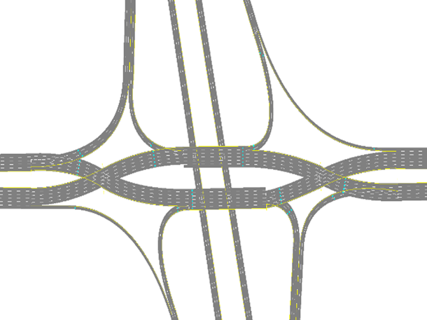


# Diverging Diamond Interchange (DDI), Sarasota

This interchange form is modeled after the diverging diamond interchange configuration currently in place at I-75/University Parkway (Sarasota; Latitude/Longitude: 27°23'19.13"N/82°26'55.64"W)

Information on how to process SwashSim output data for ramp metering performance measures can be found [here.](https://swashsim.miraheze.org/wiki/Tutorial_Ramp_Metering_Measures)

## Link/Detector Reference Info for Ramp Metering Measures 

|                   |   NB  |   SB  |
|-------------------| :---: | :---: |
| On-Ramp Link IDs  | 6322, 2063, 1520, 3221 | 627, 662, 366, 45 |  
| Ramp Meter Passage Detectors | Link: 6322; Lanes: 1,2; Detector ID: 2 | Link: 627; Lanes: 1,2; Detector ID: 2 |
