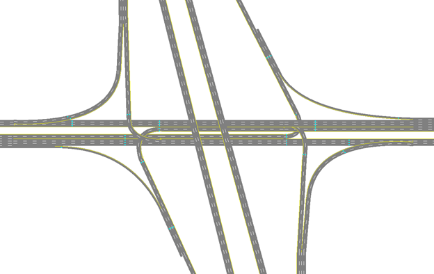


# Diamond Interchange, Sarasota

This interchange form is modeled after the diamond interchange configuration that was recently replaced with a diverging diamond configuration, at I-75/University Parkway (Sarasota; Latitude/Longitude: 27°23'19.13"N/82°26'55.64"W). 

Information on how to process SwashSim output data for ramp metering performance measures can be found [here.](https://swashsim.miraheze.org/wiki/Tutorial_Ramp_Metering_Measures)

## Link/Detector Reference Info for Ramp Metering Measures 

|              |   NB   |   SB   |
|--------------|--------|--------|
| On-Ramp Link IDs             | 8022, 7280, 2072, 6920, 3021 | 737, 7173, 671, 706, 45 |  
| Ramp Meter Passage Detectors | Link: 8022; Lanes: 1,2; Detector ID: 2 | Link: 737; Lanes: 1,2; Detector ID: 2 |
