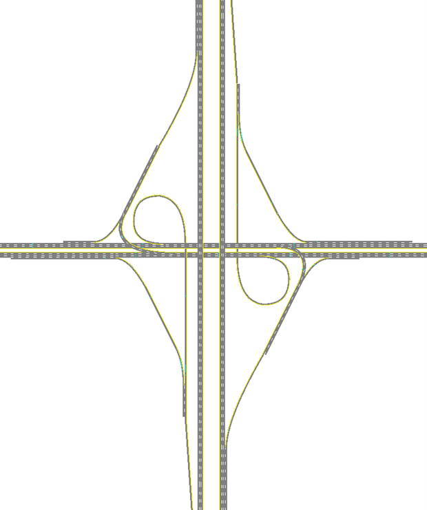

# Partial Cloverleaf Interchange

This interchange form is generally modeled after the ParClo configuration currently in place at Tierra Moorpark Freeway/Rejada Rd (Los Angeles; Latitude/Longitude: 34°16'0.36"N/118°51'4.31"W). 

Information on how to process SwashSim output data for ramp metering performance measures can be found [here.](https://swashsim.miraheze.org/wiki/Tutorial_Ramp_Metering_Measures)

## Link/Detector Reference Info for Ramp Metering Measures 

|              |   NB   |   SB   |
|--------------|--------|--------|
| On-Ramp Link IDs  | Direct: 3233, 3132, 2931 | Direct: 56, 45, 34 |
|                   | Loop: 2034, 2720, 2627, 2226   | Loop: 467, 5546, 5455, 4854 |  
| Ramp Meter Passage Detectors | Link: 3233, Lane: 1, Detector ID: 2 | Link: 56, Lane: 1, Detector ID: 2 |
|                              | Link: 2034, Lane: 1, Detector ID: 3 | Link: 467, Lane: 1, Detector ID: 3 |
