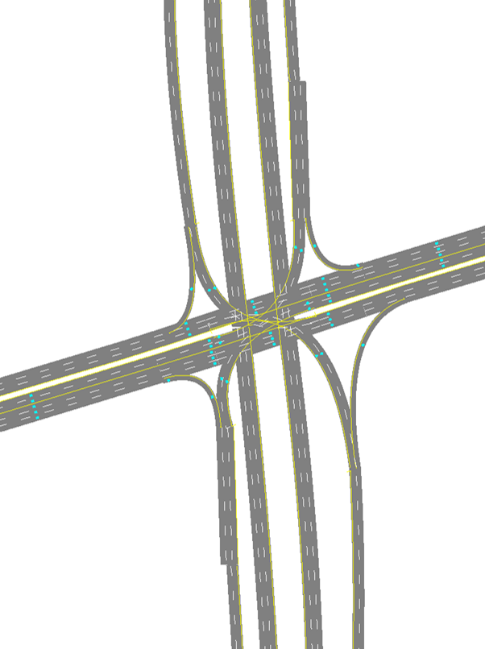

# Single Point Urban Interchange (SPUI)

This interchange form is generally modeled after the SPUI configuration currently in place at I-295/US-90 (Jacksonville; Latitude/Longitude: 30°17'13.02"N/ 81°31'18.27"W). 

Information on how to process SwashSim output data for ramp metering performance measures can be found [here.](https://swashsim.miraheze.org/wiki/Tutorial_Ramp_Metering_Measures)

## Link/Detector Reference Info for Ramp Metering Measures 

|                   |   NB  |   SB  |
|-------------------| ----- | ----- |
| On-Ramp Link IDs  | 2021, 1920, 1819, 1118, 2526 | 78, 67, 56, 34, 275 |  
| Ramp Meter Passage Detectors | Link: 2021, Lanes: 1, 2, Detector ID: 3 | Link: 78, Lanes: 1, 2, Detector ID: 3 |
